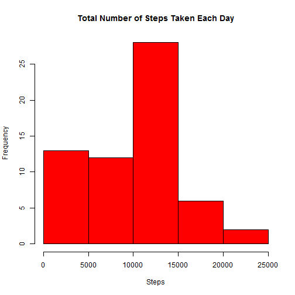
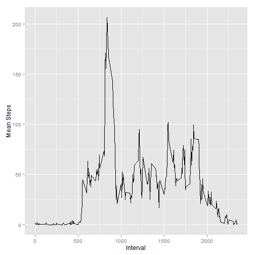
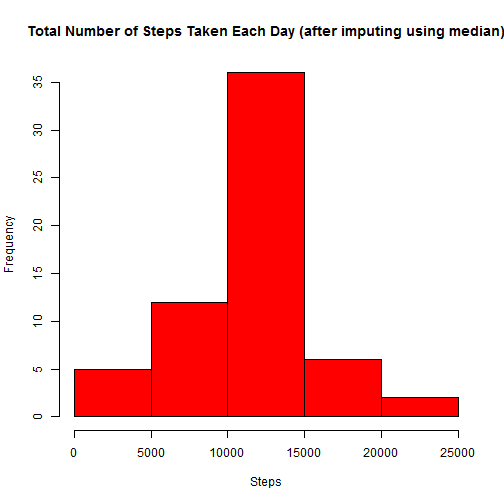
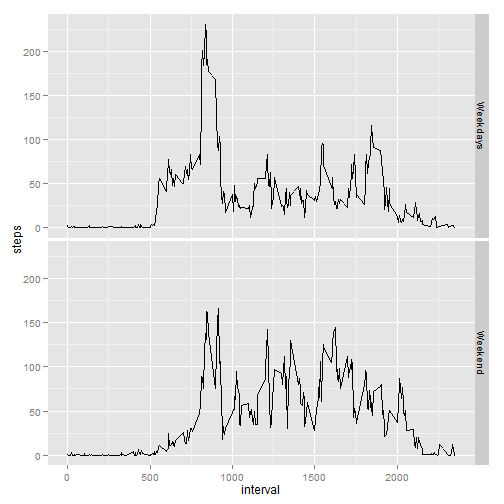

Reproducible Research: Peer Assessment 1
==============================================

## Loading and preprocessing the data

The source dataset is from the following website: [Activity monitoring data](https://d396qusza40orc.cloudfront.net/repdata%2Fdata%2Factivity.zip). The dataset is a zipped csv file and os downloaded into session temp folder, unzipped and read into dataframe. Session temp folder is obtained through tempdir(0 which is independant from the platform.


```r
fileUrl <- "https://d396qusza40orc.cloudfront.net/repdata%2Fdata%2Factivity.zip" 
setwd(tempdir())
download.file(fileUrl, destfile = "activity.zip")
unzip("activity.zip")
raw.data <- read.csv("activity.csv")
```

## What is mean total number of steps taken per day?

First, aggregate the steps by date.


```r
# Prepare the data for the hitogram diagram
raw.summary <- aggregate(raw.data$steps, by=list(raw.data$date), FUN="sum", na.rm = TRUE)
names(raw.summary) <- c("date", "steps")
```

And, then create a histogram of total number of steps taken each day.


```r
# Make a histogram of the total number of steps taken each day
hist(raw.summary$steps, col = "Red", main="Total Number of Steps Taken Each Day",
     xlab="Steps")
```

 

Here is the mean total number of steps taken per day:


```r
# Calculate and report the mean total number of steps taken per day
mean(raw.summary$steps, na.rm=TRUE)
```

```
## [1] 9354.23
```

and here is the median total number of steps taken per day:


```r
#Calculate and report the median total number of steps taken per day

median(raw.summary$steps, na.rm=TRUE)
```

```
## [1] 10395
```

## What is the average daily activity pattern?

First, calculate the mean number of steps cross all the days for each 5-minutes interval.


```r
# Average daily activity pattern
interval.mean <- aggregate(raw.data$step, by=list(raw.data$interval), FUN="mean", na.rm=TRUE)
names(interval.mean) <- c("interval", "mean.steps")
```

Then, make a time series plot of the 5-minute interval and the mean number of steps taken avreaged through all the days.


```r
library("ggplot2")
library("plyr")
ggplot(interval.mean, aes(interval, y=mean.steps))+geom_line() + ylab("Mean Steps") + 
  xlab("Interval")
```

 

From the plot, as expected, the steps taken during mid-night is close to zero ( from interval 0 to 500), and the intervals with maximum total number of steps taken are from the morning. The interval with maximum mean steps is:


```r
# Find the interval with Maximum mean steps
interval.mean[which.max(interval.mean$mean.steps), "interval"]
```

```
## [1] 835
```


## Imputing missing values

First, the total number of missing values is calculated.


```r
# Total number of missing values
sum(is.na(raw.data$steps))
```

```
## [1] 2304
```

The mean steps of each interval are used to fill the missing values for corresponding intervals.


```r
# Fill the NA with the mean value in the same interval

fill <- function(x) {
  if (is.na(x["steps"])) {
    index <- which(interval.mean$interval==as.numeric(x["interval"]))
    return (interval.mean[index, "mean.steps"])
  }
  else return (as.numeric(x["steps"]))
}

steps <- apply(raw.data, 1, FUN="fill" )

imputed.data <- raw.data
imputed.data$steps <- steps
```

Aggregate the steps by date using the imputed data.


```r
# aggregate across all intervals for each day

imputed.summary <- aggregate(imputed.data$steps, by=list(imputed.data$date), FUN="sum")
names(imputed.summary) <- c("date", "steps")
```

Make a histogram of total number steps taken each day using the imputed dataset.


```r
#Histogram for the new data with imputing
hist(imputed.summary$steps, col = "Red", main="Total Number of Steps Taken Each Day (after imputing using median)",
     xlab="Steps")
```

 

And the mean total number of steps taken per day based on imputed dataset is.


```r
# Calculate the mean
mean(imputed.summary$steps)
```

```
## [1] 10766.19
```

And the median total number of steps taken per day based on imputed dataset is.


```r
median(imputed.summary$steps)
```

```
## [1] 10766.19
```

## Are there differences in activity patterns between weekdays and weekends

First, identify the weekdays and weekends


```r
# Convert to date to weekdays or weekend
imputed.data$date <- strptime(imputed.data$date, format="%Y-%m-%d")
imputed.data$weekdays <- weekdays(imputed.data$date, abbreviate=TRUE)
imputed.data$daytype <- sapply(imputed.data$weekdays, function(x) {if (x %in% c("Sun", "Sat")) return ("Weekend") else return ("Weekdays")})
```

Calculate the mean steps taken averaged across all weekday days and weekend days.


```r
imputed.summary2 <- aggregate(imputed.data$steps, by=list(interval=imputed.data$interval, daytype=imputed.data$daytype), FUN="mean")
names(imputed.summary2) <- c("interval", "daytype", "steps")
```

Make a panel plot containing a time series plot of the 5-minute interval and the average number of steps taken, averaged across all weekday days and weekend days.


```r
p <- ggplot() + geom_line(data=imputed.summary2, 
     aes(x=imputed.summary2$interval, y=imputed.summary2$steps)) +
     facet_grid(daytype ~.) + xlab("interval") + ylab("steps") 
print(p)
```

 

As expected, on the weekday days, the steps taken peaked in the morning. During weekend, the steps taken is even out all the daytime.
